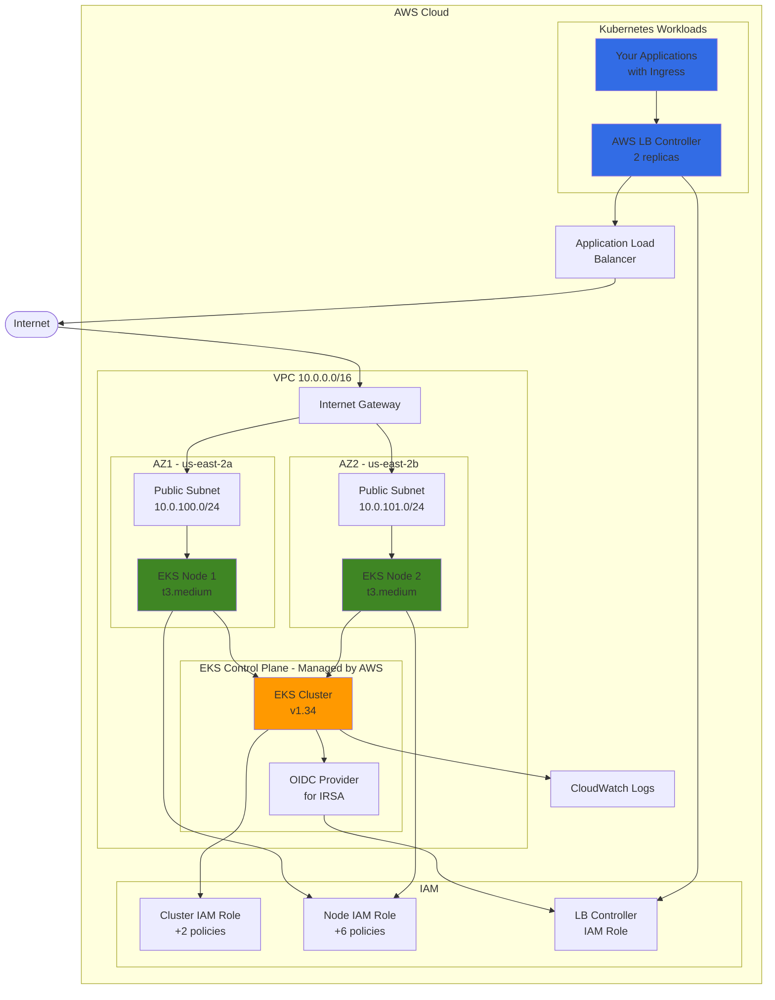
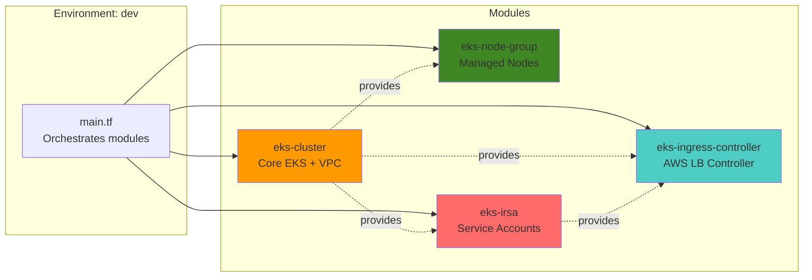
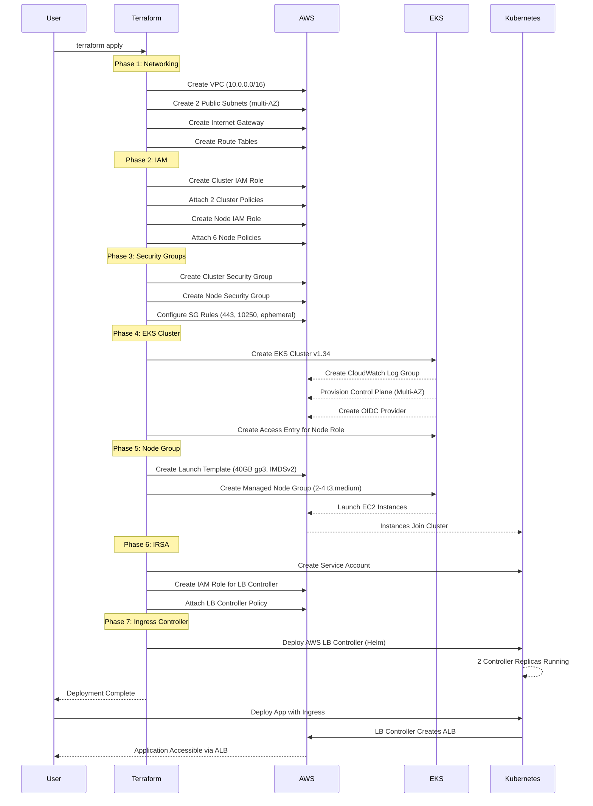
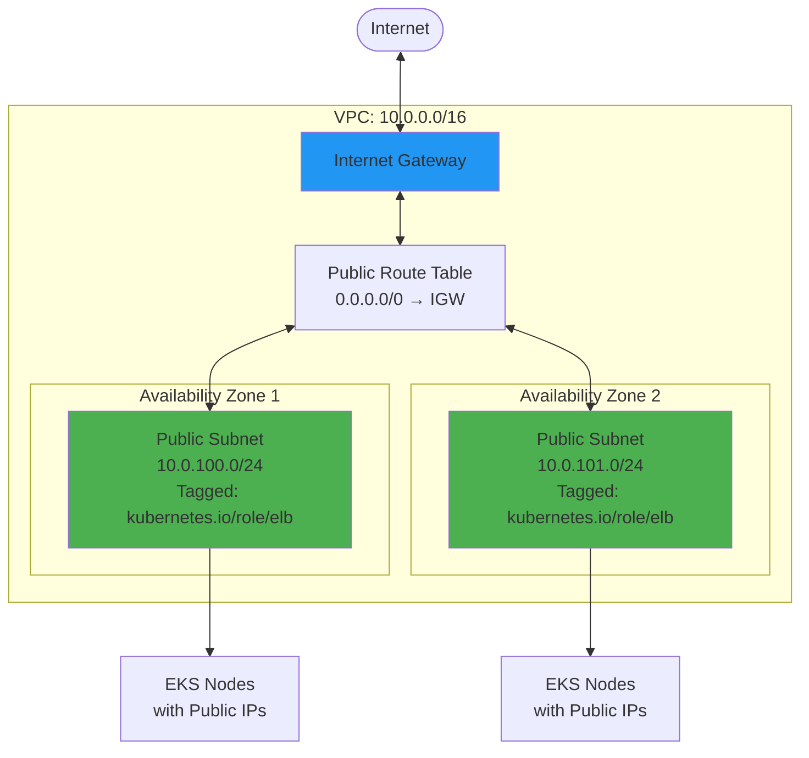
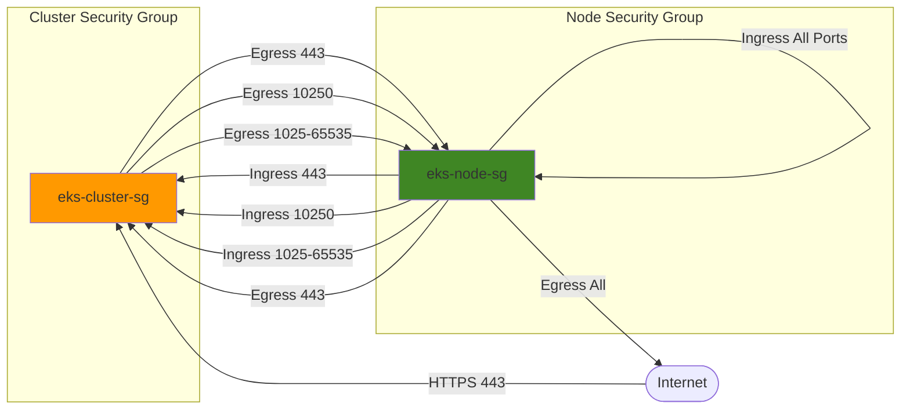
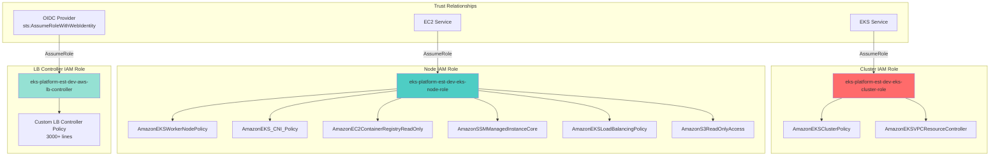
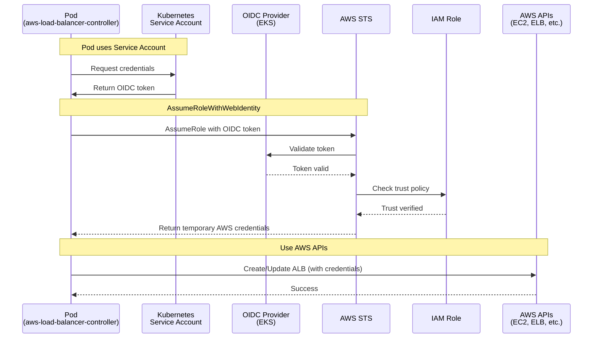
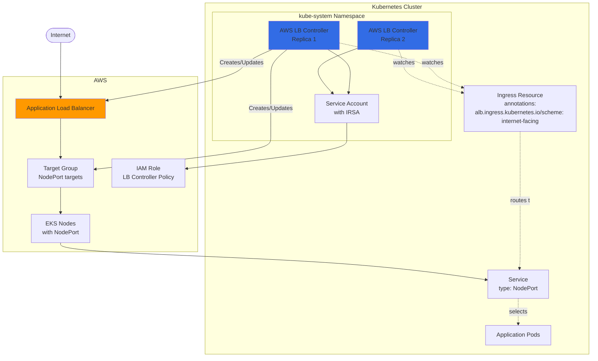
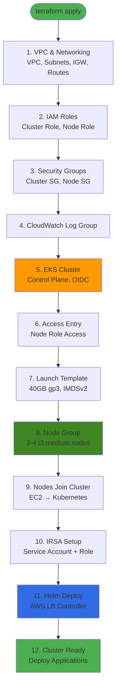

# AWS EKS Infrastructure Guide

## Overview

This project provides a production-ready, modular Terraform infrastructure for deploying Amazon EKS (Elastic Kubernetes Service) clusters with managed node groups, VPC networking, IRSA (IAM Roles for Service Accounts), and the AWS Load Balancer Controller.

**Key Features:**
- ✅ Modular, reusable Terraform architecture
- ✅ Optional VPC creation or use existing VPC
- ✅ EKS cluster with managed node groups
- ✅ IRSA (IAM Roles for Service Accounts) with OIDC provider
- ✅ AWS Load Balancer Controller for Ingress
- ✅ Encrypted EBS volumes with IMDSv2 enforcement
- ✅ Multi-AZ high availability
- ✅ Production-ready security configurations

---

## Architecture Overview



---

## Module Structure

The infrastructure is organized into **4 reusable modules** that work together:



### Module Responsibilities

| Module | Purpose | Key Resources |
|--------|---------|---------------|
| **eks-cluster** | Core EKS cluster, networking, IAM, security groups | VPC, Subnets, IGW, EKS Cluster, OIDC Provider, IAM Roles, Security Groups |
| **eks-node-group** | Managed worker nodes with launch template | Launch Template, EKS Node Group, Auto Scaling |
| **eks-irsa** | IAM Roles for Service Accounts integration | Kubernetes Service Account, IAM Role with Trust Policy |
| **eks-ingress-controller** | AWS Load Balancer Controller via Helm | Helm Release, Controller Deployment |

---

## Directory Structure

```
aws-eks/
├── modules/                          # Reusable Terraform modules
│   ├── eks-cluster/                  # Core EKS cluster module
│   │   ├── main.tf                   # EKS cluster, OIDC provider, access entry
│   │   ├── networking.tf             # VPC, subnets, IGW, NAT, route tables
│   │   ├── security_groups.tf        # Cluster and node security groups
│   │   ├── iam.tf                    # IAM roles and policies
│   │   ├── variables.tf              # Input variables
│   │   ├── outputs.tf                # Module outputs
│   │   ├── locals.tf                 # Local values
│   │   └── data.tf                   # Data sources
│   │
│   ├── eks-node-group/               # Managed node group module
│   │   ├── main.tf                   # Launch template + node group
│   │   ├── variables.tf
│   │   ├── outputs.tf
│   │   └── locals.tf
│   │
│   ├── eks-irsa/                     # IRSA module
│   │   ├── main.tf                   # Service account + IAM role
│   │   ├── variables.tf
│   │   ├── outputs.tf
│   │   └── locals.tf
│   │
│   └── eks-ingress-controller/       # AWS LB Controller module
│       ├── main.tf                   # Helm release
│       ├── variables.tf
│       └── outputs.tf
│
├── branches/                         # Environment-specific configurations
│   └── tech-branch-est/
│       └── dev/                      # Development environment
│           ├── main.tf               # Module orchestration
│           ├── variables.tf          # Environment variables
│           ├── outputs.tf            # Environment outputs
│           ├── data.tf               # Data sources
│           ├── locals.tf             # Local values
│           ├── provider.tf           # AWS provider config
│           ├── backend.tf            # State backend (local/S3)
│           ├── terraform.tfvars      # Variable values
│           └── aws-lb-controller-iam-policy.json  # IAM policy
│
└── README.md                         # Quick start guide
```

---

## Deployment Flow



---

## Network Architecture

### VPC Configuration (when vpc_create = true)



### Network Flow

1. **Public Subnets**: 10.0.100.0/24 (AZ1) and 10.0.101.0/24 (AZ2)
2. **Internet Gateway**: Provides internet access for nodes
3. **Route Table**: Routes 0.0.0.0/0 to IGW for public internet access
4. **Subnet Tagging**:
   - `kubernetes.io/role/elb = "1"` - Allows ALB creation
   - `kubernetes.io/cluster/<cluster-name> = "owned"` - EKS ownership

---

## Security Groups



### Security Group Rules

**Cluster Security Group:**
- ✅ Egress to nodes on 443 (HTTPS)
- ✅ Egress to nodes on 10250 (kubelet API)
- ✅ Egress to nodes on 1025-65535 (ephemeral for CoreDNS)

**Node Security Group:**
- ✅ Ingress from cluster on 443, 10250, 1025-65535
- ✅ Ingress from other nodes on all ports (pod-to-pod)
- ✅ Egress to cluster on 443 (API server)
- ✅ Egress to internet on all ports (pull images, etc.)

---

## IAM Roles and Policies



### IAM Policy Details

**Cluster Role Policies:**
1. `AmazonEKSClusterPolicy` - Core EKS cluster operations
2. `AmazonEKSVPCResourceController` - VPC resource management (ENIs, security groups)

**Node Role Policies:**
1. `AmazonEKSWorkerNodePolicy` - Worker node operations
2. `AmazonEKS_CNI_Policy` - VPC CNI plugin for pod networking
3. `AmazonEC2ContainerRegistryReadOnly` - Pull images from ECR
4. `AmazonSSMManagedInstanceCore` - Systems Manager access for debugging
5. `AmazonEKSLoadBalancingPolicy` - Manage load balancers for services
6. `AmazonS3ReadOnlyAccess` - Pull artifacts from S3

**LB Controller Role:**
- Custom policy with 3000+ lines covering ALB/NLB/TargetGroup management

---

## IRSA (IAM Roles for Service Accounts)



### How IRSA Works

1. **Service Account**: Created in `kube-system` namespace with annotation pointing to IAM role ARN
2. **OIDC Provider**: EKS cluster has OIDC endpoint for token validation
3. **IAM Role**: Trust policy allows `sts:AssumeRoleWithWebIdentity` from OIDC provider
4. **Pod Authentication**: Pod presents OIDC token → STS validates → Returns temporary credentials
5. **AWS API Access**: Pod uses credentials to call AWS APIs (create ALB, modify target groups, etc.)

---

## AWS Load Balancer Controller



### Load Balancer Controller Workflow

1. **Watch Ingress Resources**: Controller continuously watches for Ingress/Service changes
2. **Create ALB**: When Ingress is created, controller provisions ALB in AWS
3. **Configure Target Groups**: Creates target groups pointing to node IPs + NodePort
4. **Configure Listeners**: Sets up HTTP/HTTPS listeners based on Ingress rules
5. **Reconcile State**: Continuously syncs Kubernetes state with AWS resources
6. **Cleanup**: Deletes ALB/TGs when Ingress is removed

---

## Resource Creation Order



### Dependencies Explained

1. **VPC First**: Network infrastructure must exist before any resources
2. **IAM Before EKS**: Roles must exist for cluster/node creation
3. **Security Groups Before EKS**: SGs must exist to attach to cluster
4. **CloudWatch Before EKS**: Log group for control plane logs
5. **EKS Before Node Group**: Cluster must exist for nodes to join
6. **Access Entry After EKS**: Grants node role permission to join cluster
7. **Launch Template Before Node Group**: Template defines node configuration
8. **Nodes Before IRSA**: Cluster must be functional for service account creation
9. **IRSA Before Helm**: Service account needed for LB controller
10. **Helm Last**: Controller deployed after all infrastructure ready

---

## How Resources Are Deployed

### Step 1: Initialize Terraform

```bash
cd /workspaces/dev-container-terraform/terraform-aws-projects/aws-eks/branches/tech-branch-est/dev
terraform init
```

**What happens:**
- Downloads AWS provider plugin
- Initializes backend (local or S3)
- Downloads module dependencies

### Step 2: Review Configuration

Key files:
- `terraform.tfvars` - Variable values (cluster version, region, etc.)
- `main.tf` - Module orchestration
- `variables.tf` - Variable definitions

### Step 3: Plan Deployment

```bash
terraform plan --profile default-est-2
```

**Terraform calculates:**
- Resources to create: ~45 resources
- Dependencies between resources
- Order of operations

### Step 4: Apply Configuration

```bash
terraform apply --profile default-est-2
```

**Deployment timeline (approximate):**
- VPC & Networking: 2-3 minutes
- IAM Roles: 1 minute
- EKS Cluster: 10-15 minutes (AWS provisions control plane)
- Node Group: 5-10 minutes (EC2 instances launch and join)
- IRSA: 1 minute
- Helm (LB Controller): 2-3 minutes

**Total: ~25-35 minutes**

---

## Configuration Options

### VPC Creation (Option 1: Create New VPC)

```hcl
module "eks_cluster" {
  vpc_create              = true              # Create new VPC
  vpc_cidr                = "10.0.0.0/16"     # VPC CIDR
  availability_zone_count = 2                 # Number of AZs
  create_private_subnets  = false             # Public only
}
```

### VPC Creation (Option 2: Use Existing VPC)

```hcl
module "eks_cluster" {
  vpc_create = false                          # Use existing VPC
  vpc_id     = "vpc-xxxxx"                    # Existing VPC ID
  subnet_ids = ["subnet-aaa", "subnet-bbb"]   # Existing subnet IDs
}
```

### Node Group Sizing

```hcl
module "eks_node_group_system" {
  instance_types = ["t3.medium"]              # Instance type
  disk_size      = 40                         # EBS volume size (GB)
  disk_type      = "gp3"                      # Volume type

  capacity_type  = "ON_DEMAND"                # ON_DEMAND or SPOT
  desired_size   = 2                          # Desired node count
  min_size       = 2                          # Minimum nodes
  max_size       = 4                          # Maximum nodes
}
```

---

## Cost Breakdown (Monthly Estimates)

| Resource | Configuration | Monthly Cost |
|----------|---------------|--------------|
| **EKS Control Plane** | 1 cluster | ~$73.00 |
| **EC2 Nodes** | 2x t3.medium (on-demand) | ~$60.00 |
| **EBS Volumes** | 2x 40GB gp3 | ~$6.40 |
| **Data Transfer** | Variable | ~$5-10 |
| **CloudWatch Logs** | Control plane logs | ~$2-5 |
| **ALB** | Per load balancer | ~$16-25 |
| **VPC** | VPC, subnets, IGW | $0 (free) |
| | **Total (without ALB)** | **~$141-144** |
| | **Total (with 1 ALB)** | **~$157-169** |

**Cost Optimization Tips:**
- Use Spot instances for non-critical workloads (50-70% savings on EC2)
- Right-size instance types based on actual usage
- Enable Cluster Autoscaler to scale nodes down during low traffic
- Use Savings Plans or Reserved Instances for predictable workloads
- Set CloudWatch log retention to 7-14 days instead of forever

---

## Accessing the Cluster

### Configure kubectl

```bash
aws eks update-kubeconfig --name eks-platform-est-dev-eks --region us-east-2 --profile default-est-2
```

### Verify Cluster Access

```bash
# Check cluster info
kubectl cluster-info

# List nodes
kubectl get nodes

# Check AWS LB Controller
kubectl get pods -n kube-system -l app.kubernetes.io/name=aws-load-balancer-controller

# View controller logs
kubectl logs -n kube-system -l app.kubernetes.io/name=aws-load-balancer-controller --tail=50
```

---

## Deploying Applications with Ingress

### Example: Deploy Sample App with ALB

```yaml
---
apiVersion: apps/v1
kind: Deployment
metadata:
  name: nginx-app
spec:
  replicas: 3
  selector:
    matchLabels:
      app: nginx
  template:
    metadata:
      labels:
        app: nginx
    spec:
      containers:
      - name: nginx
        image: nginx:latest
        ports:
        - containerPort: 80
---
apiVersion: v1
kind: Service
metadata:
  name: nginx-service
spec:
  type: NodePort
  selector:
    app: nginx
  ports:
  - port: 80
    targetPort: 80
---
apiVersion: networking.k8s.io/v1
kind: Ingress
metadata:
  name: nginx-ingress
  annotations:
    alb.ingress.kubernetes.io/scheme: internet-facing
    alb.ingress.kubernetes.io/target-type: ip
    alb.ingress.kubernetes.io/healthcheck-path: /
spec:
  ingressClassName: alb
  rules:
  - http:
      paths:
      - path: /
        pathType: Prefix
        backend:
          service:
            name: nginx-service
            port:
              number: 80
```

**What happens:**
1. Deployment creates 3 nginx pods
2. Service exposes pods via NodePort
3. Ingress triggers AWS LB Controller
4. Controller creates ALB in AWS
5. ALB routes traffic to node IPs + NodePort
6. Nodes forward to nginx pods

**Get ALB URL:**
```bash
kubectl get ingress nginx-ingress -o jsonpath='{.status.loadBalancer.ingress[0].hostname}'
```

---

## Troubleshooting

### Nodes Not Joining Cluster

**Symptoms:** Node group status is `CREATE_FAILED` with "NodeCreationFailure"

**Common causes:**
1. ❌ Nodes don't have public IPs (fixed by removing network_interfaces block)
2. ❌ Access entry missing or misconfigured
3. ❌ Security groups blocking kubelet communication
4. ❌ IAM instance profile not attached

**Diagnosis:**
```bash
# Check node group status
aws eks describe-nodegroup --cluster-name <cluster> --nodegroup-name <nodegroup>

# Check instance details
aws ec2 describe-instances --instance-ids <id>

# Check access entries
aws eks list-access-entries --cluster-name <cluster>
```

### Helm Chart Conflicts

**Symptom:** `ServiceAccount exists and cannot be imported`

**Cause:** IRSA module creates service account, Helm also tries to create it

**Fix:** Set `serviceAccount.create = false` in Helm values

### ALB Not Created

**Symptoms:** Ingress created but no ALB in AWS

**Diagnosis:**
```bash
# Check controller logs
kubectl logs -n kube-system -l app.kubernetes.io/name=aws-load-balancer-controller

# Common issues:
# - Missing subnet tags (kubernetes.io/role/elb)
# - IAM permissions insufficient
# - Ingress annotations incorrect
```

---

## Module Variables Reference

### eks-cluster Module

| Variable | Type | Default | Description |
|----------|------|---------|-------------|
| `project_name` | string | - | Project identifier |
| `environment` | string | - | Environment (dev/staging/prod) |
| `branch_identifier` | string | - | Branch identifier |
| `cluster_version` | string | "1.34" | Kubernetes version |
| `vpc_create` | bool | false | Create new VPC |
| `vpc_cidr` | string | "10.0.0.0/16" | VPC CIDR block |
| `vpc_id` | string | null | Existing VPC ID |
| `subnet_ids` | list(string) | null | Existing subnet IDs |
| `cluster_endpoint_public_access` | bool | true | Enable public API access |
| `enabled_cluster_log_types` | list(string) | [] | Control plane log types |

### eks-node-group Module

| Variable | Type | Default | Description |
|----------|------|---------|-------------|
| `cluster_name` | string | - | EKS cluster name |
| `node_role_arn` | string | - | Node IAM role ARN |
| `subnet_ids` | list(string) | - | Subnet IDs for nodes |
| `instance_types` | list(string) | ["t3.medium"] | Instance types |
| `disk_size` | number | 40 | EBS volume size (GB) |
| `capacity_type` | string | "ON_DEMAND" | ON_DEMAND or SPOT |
| `desired_size` | number | 2 | Desired node count |
| `min_size` | number | 2 | Minimum nodes |
| `max_size` | number | 4 | Maximum nodes |

---

## Security Best Practices

### ✅ Implemented

- **Encrypted EBS volumes** - All node volumes encrypted at rest
- **IMDSv2 enforced** - Prevents SSRF attacks on instance metadata
- **Least privilege IAM** - Only necessary policies attached
- **Security groups** - Restrict traffic to required ports only
- **Private subnets option** - Can deploy nodes in private subnets with NAT
- **IRSA** - Service accounts use temporary credentials, not node role
- **API authentication** - `API_AND_CONFIG_MAP` mode with access entries

### 🔒 Additional Recommendations

1. **Enable EKS secrets encryption** - Use KMS to encrypt Kubernetes secrets
2. **Enable VPC flow logs** - Audit network traffic
3. **Use private endpoints** - Disable public cluster endpoint for production
4. **Implement Pod Security Standards** - Enforce pod security policies
5. **Enable audit logging** - Send to CloudWatch for compliance
6. **Network policies** - Restrict pod-to-pod communication
7. **RBAC** - Implement least-privilege Kubernetes RBAC

---

## Maintenance Operations

### Upgrade Kubernetes Version

```bash
# Update variable
# In variables.tf: cluster_version = "1.35"

terraform plan
terraform apply

# Update nodes (requires rolling update)
# Node group will be recreated with new version
```

### Scale Node Group

```bash
# Update in main.tf
desired_size = 4
max_size     = 6

terraform apply
```

### Update Launch Template

Changes to launch template trigger node group replacement:
- Disk size change
- Instance type change
- Security groups change

**Terraform will:**
1. Create new launch template version
2. Create new node group
3. Drain old nodes
4. Delete old node group

---

## Outputs

After deployment, Terraform outputs:

| Output | Description | Example |
|--------|-------------|---------|
| `cluster_name` | EKS cluster name | eks-platform-est-dev-eks |
| `cluster_endpoint` | API server endpoint | https://xxx.eks.amazonaws.com |
| `cluster_version` | Kubernetes version | 1.34 |
| `configure_kubectl` | kubectl config command | aws eks update-kubeconfig... |
| `oidc_provider_arn` | OIDC provider ARN | arn:aws:iam::xxx:oidc-provider/... |
| `vpc_id` | VPC ID | vpc-084f63964b2b6241e |
| `subnet_ids` | Subnet IDs | ["subnet-xxx", "subnet-yyy"] |

---

## Summary

This infrastructure provides a **production-ready EKS cluster** with:

- ✅ **High Availability** - Multi-AZ deployment with managed node groups
- ✅ **Security** - Encrypted volumes, IMDSv2, least-privilege IAM, IRSA
- ✅ **Scalability** - Auto-scaling groups, load balancer controller
- ✅ **Observability** - CloudWatch logs, Kubernetes metrics
- ✅ **Modularity** - Reusable modules for different environments
- ✅ **Flexibility** - Optional VPC creation, configurable sizing
- ✅ **Cost-Optimized** - Right-sized instances, spot support, cleanup policies

**Total Resources Created:** ~45 AWS resources
**Deployment Time:** ~25-35 minutes
**Monthly Cost:** ~$141-169 (dev environment)

---

## Next Steps

1. **Deploy sample application** with Ingress to test ALB creation
2. **Set up monitoring** with Prometheus + Grafana
3. **Configure Cluster Autoscaler** for dynamic node scaling
4. **Implement GitOps** with ArgoCD or Flux
5. **Add additional node groups** for different workload types (spot, GPU, etc.)
6. **Enable secrets encryption** with AWS KMS
7. **Configure backup** with Velero
8. **Set up CI/CD pipeline** for automated deployments

---

**Questions or Issues?** Check the troubleshooting section or review Terraform logs with `TF_LOG=DEBUG terraform apply`
