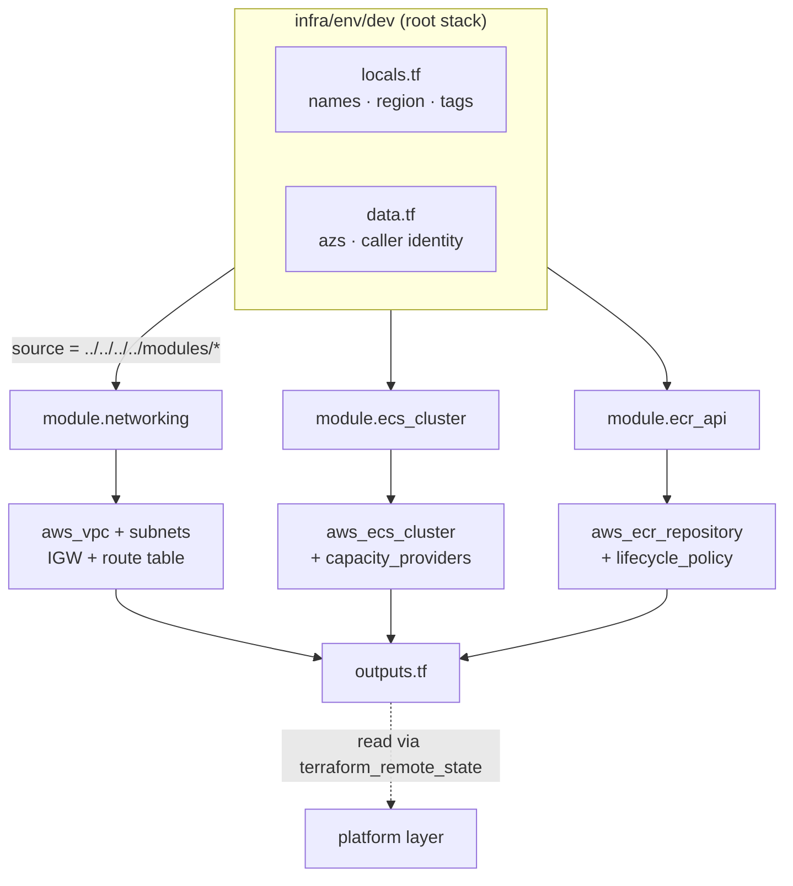
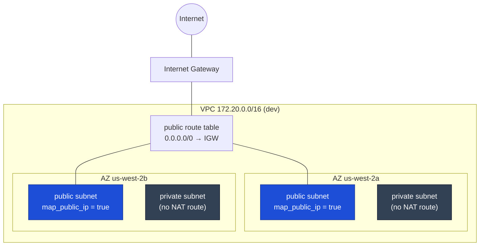
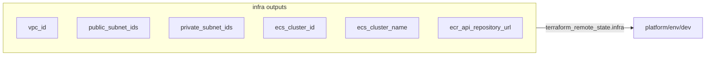
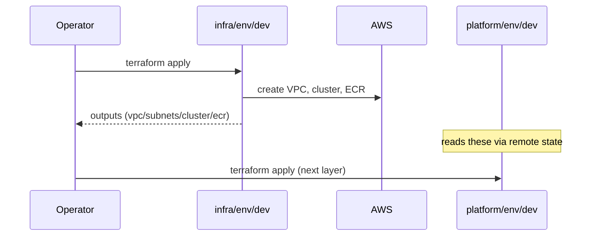

# Infra Layer — `client1`

The **foundation** layer. It provisions the long-lived, slow-changing resources that
everything else builds on: the **network**, the **ECS cluster**, and the **ECR repository**.
The [platform layer](../platform/README.md) consumes this layer's outputs and must be applied
*after* it.

> Part of [ecs-tst-env](../../../README.md). For the cross-layer design see
> [ARCHITECTURE.md](../../../ARCHITECTURE.md).

---

## What this layer owns

| Module        | Resource(s)                                                        | Purpose                              |
|---------------|-------------------------------------------------------------------|--------------------------------------|
| `networking`  | VPC, 2× public + 2× private subnets (2 AZ), IGW, public route table | Where tasks run                      |
| `ecs-cluster` | ECS cluster + `FARGATE` / `FARGATE_SPOT` capacity providers        | Compute pool for services            |
| `ecr`         | Image repository (scan-on-push, lifecycle, encryption)            | Stores the app container images      |

It owns **no services** — those live in the platform layer.

---

## Composition



---

## Network topology (dev)



> ⚠️ **No NAT gateway.** Private subnets have no outbound route today, which is why dev tasks
> run in the **public** subnets (so they can pull from ECR). Add NAT or VPC endpoints and move
> tasks to private subnets before promoting beyond dev.

---

## Outputs (the contract with platform)

These are the only values the platform layer is allowed to depend on:



| Output                   | Consumed by platform for                          |
|--------------------------|---------------------------------------------------|
| `vpc_id`                 | service security group                            |
| `public_subnet_ids`      | task placement (`assign_public_ip = true`)        |
| `private_subnet_ids`     | (available; unused in dev)                        |
| `ecs_cluster_id`         | where services attach                             |
| `ecr_api_repository_url` | base of the image reference + tag resolution      |

---

## Environment matrix

| Env   | Region      | VPC CIDR        | networking | ecs-cluster | ecr | State key                                    |
|-------|-------------|-----------------|:----------:|:-----------:|:---:|----------------------------------------------|
| `dev` | `us-west-2` | `172.20.0.0/16` | ✅         | ✅          | ✅  | `client1/dev/infra/client1-infra-dev.tfstate`|
| `stg` | `us-east-1` | `172.22.0.0/16` | ✅         | ❌          | ❌  | `client1/stg/...` *(scaffold)*               |
| `prd` | `us-east-2` | `172.21.0.0/16` | ✅         | ❌          | ❌  | `client1/prd/client1-prd.tfstate` *(scaffold)*|

> ⚠️ Only **dev** is fully wired. `stg` and `prd` currently apply **networking only** and use a
> different (`infra`) project name + naming pattern than dev (`ecs-app`).

---

## Apply

```bash
cd env/dev
terraform init
terraform plan
terraform apply
```

State: S3 backend with native lockfile (`use_lockfile = true`), encrypted. Apply this layer
**before** the platform layer; destroy it **after**.


