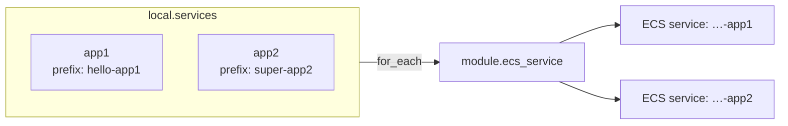
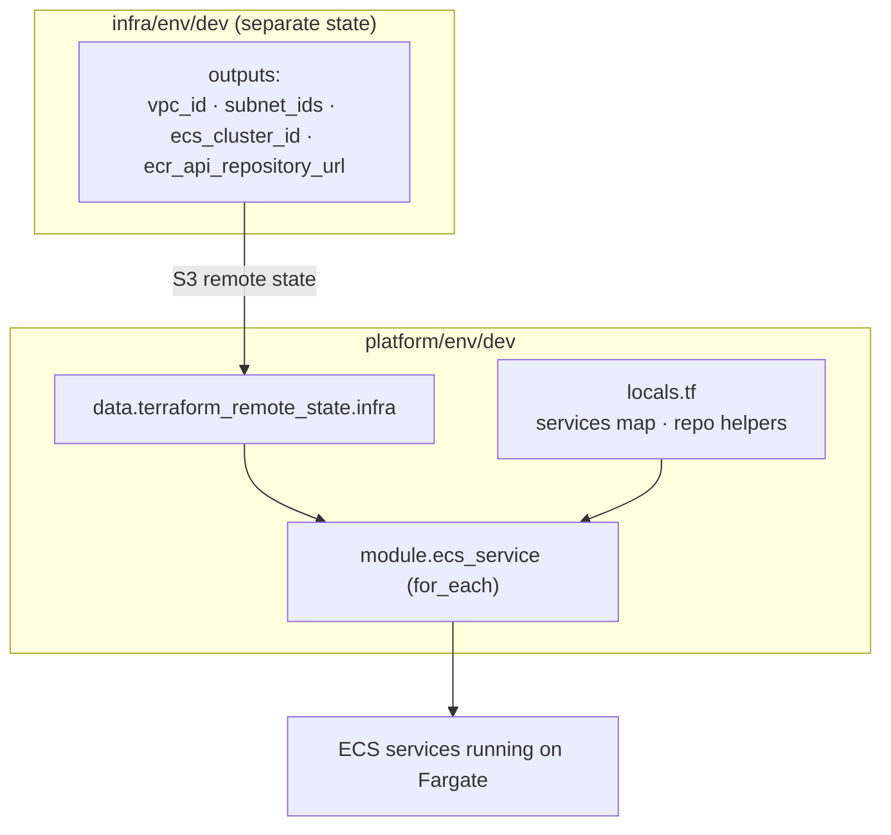
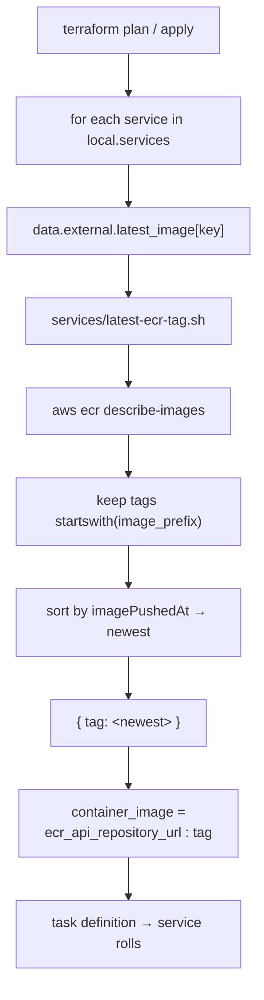
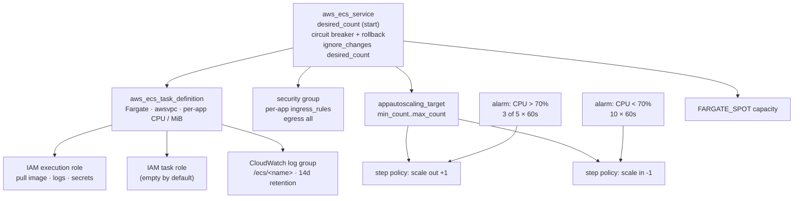
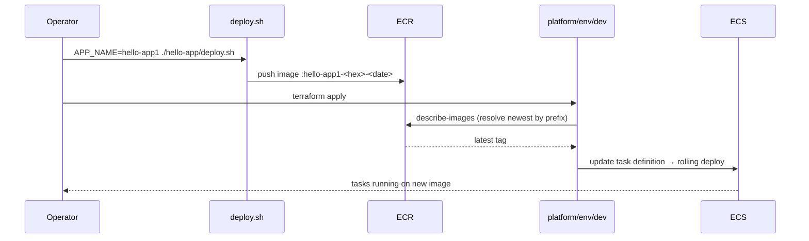

# Platform Layer — `client1`

The **application** layer. It deploys the ECS services (the running apps) onto the cluster and
network created by the [infra layer](../infra/README.md). This layer changes on every release;
the infra layer rarely does.

> Part of [ecs-tst-env](../../../README.md). For the cross-layer design see
> [ARCHITECTURE.md](../../../ARCHITECTURE.md).

---

## What this layer owns

| Module                       | Resource(s)                                              | Purpose                          |
|------------------------------|---------------------------------------------------------|----------------------------------|
| `ecs-service` (×N, `for_each`) | task definition, ECS service, security group, IAM roles, log group, **autoscaling target + step policies + CPU alarms** | One running app per `local.services` entry |

It owns **no networking, cluster, or ECR** — it reads those from the infra layer's outputs.

### Per-app configuration

Every app is configured independently in `local.services` — sizing, task count, autoscaling
bounds, and security-group rules are all per-app:

| Field                        | Controls                                                        |
|------------------------------|----------------------------------------------------------------|
| `task_cpu` / `task_memory`   | per-task Fargate sizing (must be a valid Fargate combo)         |
| `desired_count`              | starting task count                                            |
| `min_count` / `max_count`    | autoscaling bounds (set both → autoscaling is enabled)         |
| `ingress_rules`              | list of `{ cidr, from_port, to_port, protocol }` SG openings   |

If `min_count` + `max_count` are omitted, the service runs a fixed `desired_count` with no
autoscaling.

**Autoscaling is step scaling on CPU** (a CloudWatch alarm → step policy per direction). The
module defaults are:

- **scale out** `+1` task when CPU `> 70%` for **3 of the last 5** one-minute datapoints
- **scale in** `−1` task when CPU `< 70%` for **10** one-minute datapoints (10 min)

Every knob is overridable per app — add the field to that app's `local.services` entry and it
is forwarded to the module (omitted fields fall back to the default above):

| Field (per direction) | Controls |
|---|---|
| `autoscaling_high_threshold` / `autoscaling_low_threshold` | CPU % that trips scale-out / scale-in |
| `autoscaling_high_period` / `autoscaling_low_period` | seconds per datapoint |
| `autoscaling_high_evaluation_periods` / `autoscaling_low_evaluation_periods` | how many recent datapoints are examined (M) |
| `autoscaling_high_datapoints_to_alarm` / `autoscaling_low_datapoints_to_alarm` | how many must breach to fire (N) |
| `autoscaling_scale_out_adjustment` / `autoscaling_scale_in_adjustment` | tasks added / removed per step |
| `autoscaling_scale_out_cooldown` / `autoscaling_scale_in_cooldown` | seconds between successive scale events |

> Alarm window = `period × evaluation_periods`; the alarm fires when `datapoints_to_alarm` of
> those datapoints breach. `period` is **per datapoint**, not the total window.



Add a new app = add one entry to `local.services` in `locals.tf`. No copied blocks.

---

## Dependency on the infra layer



If the infra layer hasn't been applied, this layer's plan has no outputs to read and fails.

---

## Image resolution (auto-latest)

This layer takes **no image tag as input**. For each service it resolves the **newest pushed
image** in the shared ECR repo whose tag starts with that service's `image_prefix`.



**Implication:** push a new image with `deploy.sh`, re-run `terraform apply`, and the service
rolls to the latest build automatically. Because resolution happens at *plan time*, applies
are **not fully reproducible** — fine for dev, pin explicit tags for prod.

Requires `aws` + `jq` on PATH and `ecr:DescribeImages` permission.

---

## Service shape (per app)

The `ecs-service` module builds this for each entry:



Autoscaling is created only when an app sets both `min_count` and `max_count`; the service's
`desired_count` drift is ignored so the autoscaler owns the live count. Dev settings: public
subnets + `assign_public_ip = true`, Fargate Spot. Front with an ALB and move to private
subnets for production.

---

## Environment matrix

| Env   | Region      | Services         | State key                                                |
|-------|-------------|------------------|---------------------------------------------------------|
| `dev` | `us-west-2` | `app1`, `app2`   | `client1/dev/platform/client1-platform-dev.tfstate`     |
| `stg` | —           | *(none yet)*     | —                                                       |
| `prd` | —           | *(none yet)*     | —                                                       |

> ⚠️ Only `platform/env/dev` exists today. There is no `platform/env/stg` or `.../prd`.

---

## Deploy workflow



```bash
# 1. build & push (from branch/client1/services)
export AWS_REGION=us-west-2
export ECR_REPO_URL=$(terraform -chdir=../infra/env/dev output -raw ecr_api_repository_url)
APP_NAME=hello-app1 BUILD_CONTEXT=$PWD/hello-app ./hello-app/deploy.sh
APP_NAME=super-app2 BUILD_CONTEXT=$PWD/super-app ./super-app/deploy.sh

# 2. apply this layer
cd ../platform/env/dev
terraform init
terraform apply

# 3. inspect
terraform output service_names
terraform output deployed_images
```
