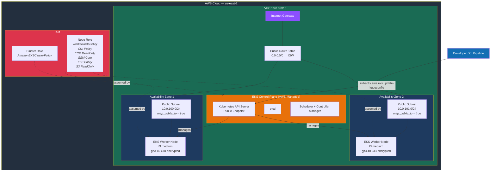
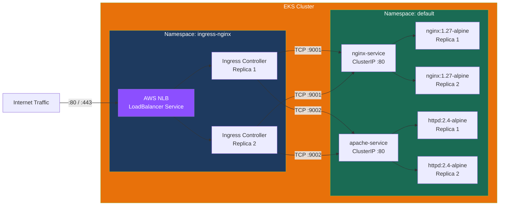
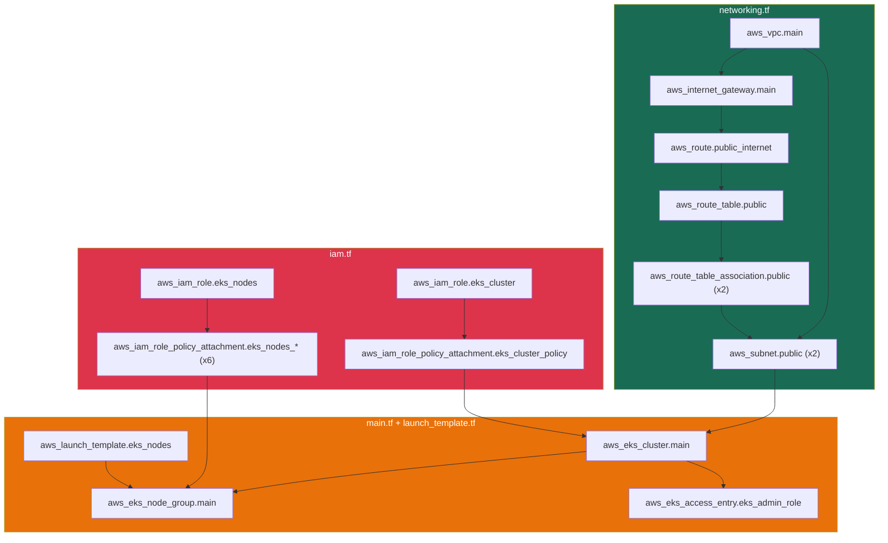

# Simple EKS — Architecture & Deployment Guide

## Overview

This project deploys an Amazon EKS (Elastic Kubernetes Service) cluster on AWS using Terraform. It provisions a complete networking layer, IAM roles, a managed node group, and sample workloads — suitable for development, testing, and learning purposes.

---

## Architecture Diagram



---

## Kubernetes Workloads Diagram

Once the cluster is running, the included manifests deploy the following workloads:



---

## Terraform Resource Map



---

## File-by-File Breakdown

| File | Purpose | Key Resources |
|---|---|---|
| `providers.tf` | AWS provider (~> 5.0), Terraform >= 1.5 | Provider block, version constraints |
| `backend.tf` | State management (local, S3 instructions commented) | Backend configuration |
| `variables.tf` | Input variables with defaults | `region`, `cluster_name`, `cluster_version`, `vpc_cidr` |
| `data.tf` | Dynamic lookups | `aws_caller_identity`, `aws_region` |
| `networking.tf` | Full VPC stack | VPC, 2 public subnets, IGW, route table, routes |
| `iam.tf` | IAM roles and policy attachments | Cluster role (1 policy), Node role (6 policies) |
| `main.tf` | EKS cluster and node group | Cluster, managed node group, access entry |
| `launch_template.tf` | EC2 node configuration | Instance type, EBS volume (gp3, encrypted) |
| `outputs.tf` | Exported values | Endpoint, name, CA cert (sensitive), kubectl command |
| `eks_bootstrap.sh` | Node bootstrap (unused by managed groups) | Shell script for manual node setup |

---

## Networking

The project creates a single VPC with **public subnets only** — designed for simplicity, not production isolation.

| Component | Configuration |
|---|---|
| VPC CIDR | `10.0.0.0/16` (65,536 IPs) |
| Public Subnet 1 | `10.0.100.0/24` — AZ 1 (256 IPs) |
| Public Subnet 2 | `10.0.101.0/24` — AZ 2 (256 IPs) |
| Internet Gateway | Single IGW attached to VPC |
| NAT Gateway | Not deployed (private subnets commented out) |
| Route Table | `0.0.0.0/0` -> IGW for all public subnets |

Subnets are tagged with `kubernetes.io/role/elb = 1` and `kubernetes.io/cluster/${cluster_name} = owned` so that the AWS Load Balancer Controller can automatically discover them for ALB/NLB placement.

---

## IAM Roles

### Cluster Role (`eks_cluster`)

| Policy | Purpose |
|---|---|
| `AmazonEKSClusterPolicy` | Allows EKS to manage cluster infrastructure |

### Node Role (`eks_nodes`)

| Policy | Purpose |
|---|---|
| `AmazonEKSWorkerNodePolicy` | Basic worker node operations |
| `AmazonEKS_CNI_Policy` | VPC CNI plugin — pod networking |
| `AmazonEC2ContainerRegistryReadOnly` | Pull images from ECR |
| `AmazonSSMManagedInstanceCore` | Session Manager for node access |
| `AmazonEKSLoadBalancingPolicy` | Manage load balancers |
| `AmazonS3ReadOnlyAccess` | Read from S3 buckets |

---

## EKS Cluster Configuration

| Setting | Value |
|---|---|
| Kubernetes Version | `1.34` (configurable) |
| Authentication Mode | `API_AND_CONFIG_MAP` |
| API Endpoint | Public only |
| Node Instance Type | `t3.medium` (2 vCPU, 4 GiB RAM) |
| Node EBS Volume | 40 GiB gp3, encrypted |
| Desired / Min / Max Nodes | 2 / 2 / 4 |
| Capacity Type | `ON_DEMAND` |
| Max Unavailable During Updates | 1 |

---

## Deployment Steps

### Prerequisites

- AWS CLI configured with valid credentials
- Terraform >= 1.5 installed
- `kubectl` installed

### Deploy

```bash
# 1. Navigate to the project
cd terraform-aws-projects/simple-eks

# 2. (Optional) Copy and edit variables
cp terraform.tfvars.example terraform.tfvars

# 3. Initialize Terraform
terraform init

# 4. Review the execution plan (~25 resources)
terraform plan

# 5. Apply — takes approximately 15-20 minutes
terraform apply

# 6. Configure kubectl using the output command
$(terraform output -raw configure_kubectl)

# 7. Verify the cluster
kubectl get nodes
kubectl get pods -n kube-system
```

### Deploy Sample Workloads

```bash
# Deploy the NGINX ingress controller
kubectl apply -f manifests/ingress-controller.yaml

# Deploy sample applications
kubectl apply -f manifests/nginx-deployment.yaml
kubectl apply -f manifests/apache-deployment.yaml

# Verify everything is running
kubectl get pods --all-namespaces
kubectl get svc -n ingress-nginx   # Get the NLB external address
```

### Tear Down

```bash
# Remove Kubernetes resources first (releases the NLB)
kubectl delete -f manifests/ingress-controller.yaml
kubectl delete -f manifests/nginx-deployment.yaml
kubectl delete -f manifests/apache-deployment.yaml

# Destroy all Terraform-managed infrastructure
terraform destroy
```

---

## Estimated Monthly Cost

| Resource | Estimated Cost |
|---|---|
| EKS Control Plane | ~$73 |
| 2x t3.medium On-Demand | ~$60 |
| Data transfer + EBS storage | ~$20 |
| **Total** | **~$150-200/month** |

To reduce costs for dev/test: switch `capacity_type` to `SPOT` (~70% savings on compute) or scale down to a single smaller node.

---

## Production Hardening Checklist

This project is intentionally simple. For production use, consider:

- [ ] Move worker nodes to **private subnets** with NAT gateway for outbound traffic
- [ ] Enable **private API endpoint** (`endpoint_private_access = true`)
- [ ] Configure **IRSA** (IAM Roles for Service Accounts) via OIDC provider
- [ ] Add **KMS encryption** for Kubernetes secrets at rest
- [ ] Enable **Network Policies** (Calico or Cilium CNI)
- [ ] Set up **Pod Security Standards** / Pod Security Admission
- [ ] Use **remote S3 backend** with DynamoDB state locking
- [ ] Separate into **environment-specific** configurations (dev/staging/prod)
- [ ] Extract reusable **Terraform modules** for VPC, EKS, and IAM
- [ ] Add **CloudWatch logging** for API server, audit, and authenticator
- [ ] Implement **Cluster Autoscaler** or **Karpenter** for dynamic scaling
- [ ] Configure **image scanning** and admission controllers
